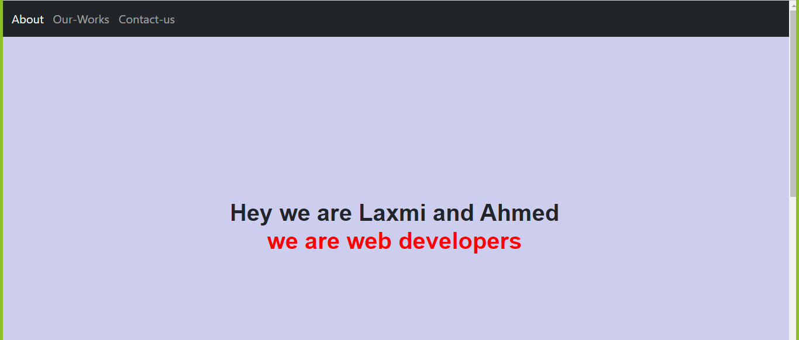

# Code Review

> This is my first code review in the Microverse . 

## Built With

- HTML, CSS
- Linters, Markdown
- GitHub Flow 

## Getting Started

To get a local copy up and running follow these simple example steps.

1) Enter `git clone git@github.com:basnetlaxmi/code-review.git` into terminal

2) Open in browser to view site

### Prerequisites

- Code editor

- Git and Github

## Author

👤 **Laxmi Basnet**

- GitHub: [@basnetlaxmi](https://github.com/basnetlaxmi)
- LinkedIn: [LinkedIn](https://np.linkedin.com/in/laxmi-basnet-b22403131)

## 🤝 Contributing

Contributions, issues, and feature requests are welcome!

Feel free to check the [issues page](../../issues/).

## Show your support

Give a ⭐️ if you like this project!

## Acknowledgments

- Microverse learning partners
- Microverse

## 📝 License

This project is [MIT](./MIT.md) licensed.
